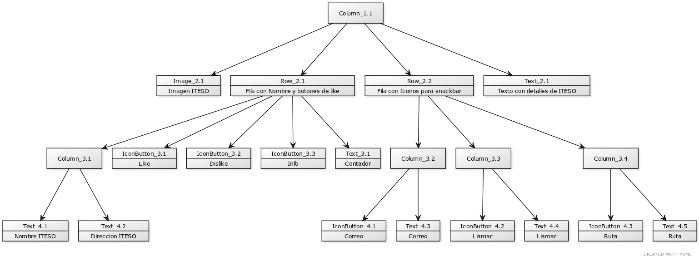

# Tarea 2 - APP INFORMATIVA ITESO, Conociendo los scaffold

El objetivo de la tarea es aprender a utilizar los widgets más comunes.

## Getting Started

Recuerda que despues de clonar el proyecto, abrir una terminal dentro de la carpeta del proyecto y ejecutar el comando:

```sh
flutter packages get
``` 
## Funcionalidad
1. El icono del boton para dar like al presionarlo cambia de color entre el default (gris) y azul (u otro color).

2. Agregar otro icono de dislike que al presionarlo cambia de color entre el default (gris) y rojo (u otro color).

3. Debe haber un texto que actualice el número de likes al presionar el botón de like o dislike.

4. Al hacer clic en los botones de llamar, mensaje o ruta mostrar un snackbar correspondiente.

5. En caso de hacer múltiples clics repetidamente el snackbar actual se debe ocultar de inmediato dando paso al nuevo snackbar.

6. Agregar un botón (en cualquier lugar de la pantalla) que revise si el contador de likes es impar muestra un diálogo con la fecha y hora, si es par muestra un diálogo con el texto “El contador de likes es par”

7. Los diálogos deben tener un título, descripción y un botón para salir del diálogo


## Arquitectura
